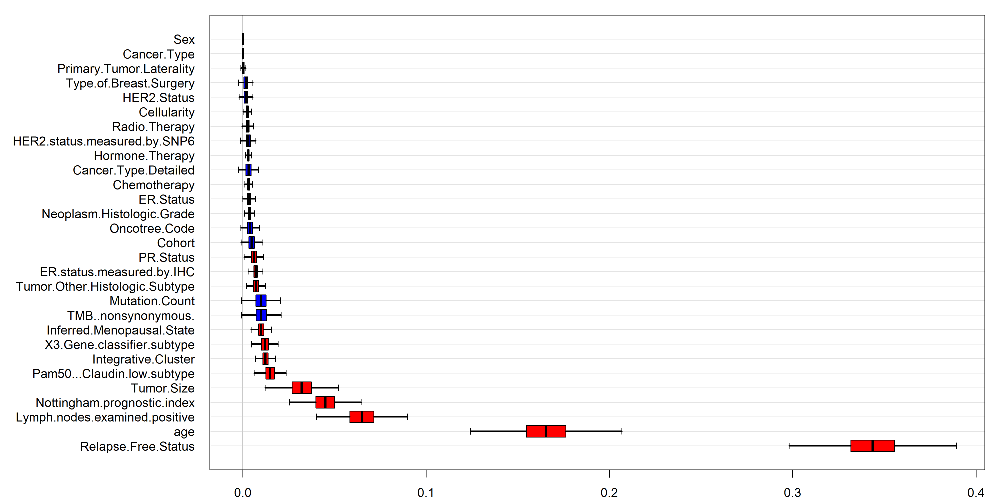

BRCA Survival Analysis
================
Vivek Golla

# Background

The following survival analysis project uses the Breast Cancer data
generated by the METABRIC GROUP, as downloaded on cbioportal.org. All
references are present in the references section.

To begin, we load all of the libraries we’re going to use:

``` r
library(randomForestSRC)
```

    ## Warning: package 'randomForestSRC' was built under R version 4.4.3

    ## 
    ##  randomForestSRC 3.3.3 
    ##  
    ##  Type rfsrc.news() to see new features, changes, and bug fixes. 
    ## 

``` r
library(ggsurvfit)
```

    ## Warning: package 'ggsurvfit' was built under R version 4.4.3

    ## Loading required package: ggplot2

``` r
library(survival)
library(survminer)
```

    ## Warning: package 'survminer' was built under R version 4.4.3

    ## Loading required package: ggpubr

    ## Warning: package 'ggpubr' was built under R version 4.4.3

    ## 
    ## Attaching package: 'survminer'

    ## The following object is masked from 'package:survival':
    ## 
    ##     myeloma

``` r
library(data.table)
library(mltools)
```

    ## Warning: package 'mltools' was built under R version 4.4.3

``` r
library(skimr)
```

    ## Warning: package 'skimr' was built under R version 4.4.3

``` r
library(knitr)
library(dplyr)
```

    ## 
    ## Attaching package: 'dplyr'

    ## The following objects are masked from 'package:data.table':
    ## 
    ##     between, first, last

    ## The following objects are masked from 'package:stats':
    ## 
    ##     filter, lag

    ## The following objects are masked from 'package:base':
    ## 
    ##     intersect, setdiff, setequal, union

``` r
library(tidyverse)
```

    ## Warning: package 'tidyverse' was built under R version 4.4.3

    ## Warning: package 'readr' was built under R version 4.4.2

    ## Warning: package 'forcats' was built under R version 4.4.3

    ## Warning: package 'lubridate' was built under R version 4.4.3

    ## ── Attaching core tidyverse packages ──────────────────────── tidyverse 2.0.0 ──
    ## ✔ forcats   1.0.0     ✔ stringr   1.5.1
    ## ✔ lubridate 1.9.4     ✔ tibble    3.2.1
    ## ✔ purrr     1.0.2     ✔ tidyr     1.3.1
    ## ✔ readr     2.1.5

    ## ── Conflicts ────────────────────────────────────────── tidyverse_conflicts() ──
    ## ✖ dplyr::between()     masks data.table::between()
    ## ✖ dplyr::filter()      masks stats::filter()
    ## ✖ dplyr::first()       masks data.table::first()
    ## ✖ lubridate::hour()    masks data.table::hour()
    ## ✖ lubridate::isoweek() masks data.table::isoweek()
    ## ✖ dplyr::lag()         masks stats::lag()
    ## ✖ dplyr::last()        masks data.table::last()
    ## ✖ lubridate::mday()    masks data.table::mday()
    ## ✖ lubridate::minute()  masks data.table::minute()
    ## ✖ lubridate::month()   masks data.table::month()
    ## ✖ purrr::partial()     masks randomForestSRC::partial()
    ## ✖ lubridate::quarter() masks data.table::quarter()
    ## ✖ tidyr::replace_na()  masks mltools::replace_na()
    ## ✖ lubridate::second()  masks data.table::second()
    ## ✖ purrr::transpose()   masks data.table::transpose()
    ## ✖ lubridate::wday()    masks data.table::wday()
    ## ✖ lubridate::week()    masks data.table::week()
    ## ✖ lubridate::yday()    masks data.table::yday()
    ## ✖ lubridate::year()    masks data.table::year()
    ## ℹ Use the conflicted package (<http://conflicted.r-lib.org/>) to force all conflicts to become errors

``` r
library(readr)
library(ggplot2)
library(tibble)
```

Next, I’m going to read in the data (as a downloaded tsv file)

``` r
df<-readr::read_tsv("brca_metabric_clinical_data.tsv", show_col_types = FALSE)
```

# Part I: Exploratory Data Analysis (EDA) and Data Cleaning

``` r
head(df, 10)
```

    ## # A tibble: 10 × 39
    ##    `Study ID` `Patient ID` `Sample ID` `Age at Diagnosis` Type of Breast Surge…¹
    ##    <chr>      <chr>        <chr>                    <dbl> <chr>                 
    ##  1 brca_meta… MB-0000      MB-0000                   75.6 MASTECTOMY            
    ##  2 brca_meta… MB-0002      MB-0002                   43.2 BREAST CONSERVING     
    ##  3 brca_meta… MB-0005      MB-0005                   48.9 MASTECTOMY            
    ##  4 brca_meta… MB-0006      MB-0006                   47.7 MASTECTOMY            
    ##  5 brca_meta… MB-0008      MB-0008                   77.0 MASTECTOMY            
    ##  6 brca_meta… MB-0010      MB-0010                   78.8 MASTECTOMY            
    ##  7 brca_meta… MB-0014      MB-0014                   56.4 BREAST CONSERVING     
    ##  8 brca_meta… MB-0020      MB-0020                   70   MASTECTOMY            
    ##  9 brca_meta… MB-0022      MB-0022                   89.1 BREAST CONSERVING     
    ## 10 brca_meta… MB-0025      MB-0025                   76.2 <NA>                  
    ## # ℹ abbreviated name: ¹​`Type of Breast Surgery`
    ## # ℹ 34 more variables: `Cancer Type` <chr>, `Cancer Type Detailed` <chr>,
    ## #   Cellularity <chr>, Chemotherapy <chr>, `Pam50 + Claudin-low subtype` <chr>,
    ## #   Cohort <dbl>, `ER status measured by IHC` <chr>, `ER Status` <chr>,
    ## #   `Neoplasm Histologic Grade` <dbl>, `HER2 status measured by SNP6` <chr>,
    ## #   `HER2 Status` <chr>, `Tumor Other Histologic Subtype` <chr>,
    ## #   `Hormone Therapy` <chr>, `Inferred Menopausal State` <chr>, …

``` r
glimpse(df)
```

    ## Rows: 2,509
    ## Columns: 39
    ## $ `Study ID`                       <chr> "brca_metabric", "brca_metabric", "br…
    ## $ `Patient ID`                     <chr> "MB-0000", "MB-0002", "MB-0005", "MB-…
    ## $ `Sample ID`                      <chr> "MB-0000", "MB-0002", "MB-0005", "MB-…
    ## $ `Age at Diagnosis`               <dbl> 75.65, 43.19, 48.87, 47.68, 76.97, 78…
    ## $ `Type of Breast Surgery`         <chr> "MASTECTOMY", "BREAST CONSERVING", "M…
    ## $ `Cancer Type`                    <chr> "Breast Cancer", "Breast Cancer", "Br…
    ## $ `Cancer Type Detailed`           <chr> "Breast Invasive Ductal Carcinoma", "…
    ## $ Cellularity                      <chr> NA, "High", "High", "Moderate", "High…
    ## $ Chemotherapy                     <chr> "NO", "NO", "YES", "YES", "YES", "NO"…
    ## $ `Pam50 + Claudin-low subtype`    <chr> "claudin-low", "LumA", "LumB", "LumB"…
    ## $ Cohort                           <dbl> 1, 1, 1, 1, 1, 1, 1, 1, 1, 1, 1, 1, 1…
    ## $ `ER status measured by IHC`      <chr> "Positve", "Positve", "Positve", "Pos…
    ## $ `ER Status`                      <chr> "Positive", "Positive", "Positive", "…
    ## $ `Neoplasm Histologic Grade`      <dbl> 3, 3, 2, 2, 3, 3, 2, 3, 2, 3, 3, 2, 2…
    ## $ `HER2 status measured by SNP6`   <chr> "NEUTRAL", "NEUTRAL", "NEUTRAL", "NEU…
    ## $ `HER2 Status`                    <chr> "Negative", "Negative", "Negative", "…
    ## $ `Tumor Other Histologic Subtype` <chr> "Ductal/NST", "Ductal/NST", "Ductal/N…
    ## $ `Hormone Therapy`                <chr> "YES", "YES", "YES", "YES", "YES", "Y…
    ## $ `Inferred Menopausal State`      <chr> "Post", "Pre", "Pre", "Pre", "Post", …
    ## $ `Integrative Cluster`            <chr> "4ER+", "4ER+", "3", "9", "9", "7", "…
    ## $ `Primary Tumor Laterality`       <chr> "Right", "Right", "Right", "Right", "…
    ## $ `Lymph nodes examined positive`  <dbl> 10, 0, 1, 3, 8, 0, 1, NA, 1, 11, 1, 0…
    ## $ `Mutation Count`                 <dbl> NA, 2, 2, 1, 2, 4, 4, NA, 1, 5, 4, 5,…
    ## $ `Nottingham prognostic index`    <dbl> 6.044, 4.020, 4.030, 4.050, 6.080, 4.…
    ## $ `Oncotree Code`                  <chr> "IDC", "IDC", "IDC", "MDLC", "MDLC", …
    ## $ `Overall Survival (Months)`      <dbl> 140.50000, 84.63333, 163.70000, 164.9…
    ## $ `Overall Survival Status`        <chr> "0:LIVING", "0:LIVING", "1:DECEASED",…
    ## $ `PR Status`                      <chr> "Negative", "Positive", "Positive", "…
    ## $ `Radio Therapy`                  <chr> "YES", "YES", "NO", "YES", "YES", "YE…
    ## $ `Relapse Free Status (Months)`   <dbl> 140.500000, 84.633333, 153.300000, 16…
    ## $ `Relapse Free Status`            <chr> "0:Not Recurred", "0:Not Recurred", "…
    ## $ `Number of Samples Per Patient`  <dbl> 1, 1, 1, 1, 1, 1, 1, 1, 1, 1, 1, 1, 1…
    ## $ `Sample Type`                    <chr> "Primary", "Primary", "Primary", "Pri…
    ## $ Sex                              <chr> "Female", "Female", "Female", "Female…
    ## $ `3-Gene classifier subtype`      <chr> "ER-/HER2-", "ER+/HER2- High Prolif",…
    ## $ `TMB (nonsynonymous)`            <dbl> 0.000000, 2.615035, 2.615035, 1.30751…
    ## $ `Tumor Size`                     <dbl> 22, 10, 15, 25, 40, 31, 10, 65, 29, 3…
    ## $ `Tumor Stage`                    <dbl> 2, 1, 2, 2, 2, 4, 2, 3, 2, 2, 2, 2, 4…
    ## $ `Patient's Vital Status`         <chr> "Living", "Living", "Died of Disease"…

``` r
skim(df)
```

|                                                  |      |
|:-------------------------------------------------|:-----|
| Name                                             | df   |
| Number of rows                                   | 2509 |
| Number of columns                                | 39   |
| \_\_\_\_\_\_\_\_\_\_\_\_\_\_\_\_\_\_\_\_\_\_\_   |      |
| Column type frequency:                           |      |
| character                                        | 27   |
| numeric                                          | 12   |
| \_\_\_\_\_\_\_\_\_\_\_\_\_\_\_\_\_\_\_\_\_\_\_\_ |      |
| Group variables                                  | None |

Data summary

**Variable type: character**

| skim_variable | n_missing | complete_rate | min | max | empty | n_unique | whitespace |
|:---|---:|---:|---:|---:|---:|---:|---:|
| Study ID | 0 | 1.00 | 13 | 13 | 0 | 1 | 0 |
| Patient ID | 0 | 1.00 | 7 | 9 | 0 | 2509 | 0 |
| Sample ID | 0 | 1.00 | 7 | 9 | 0 | 2509 | 0 |
| Type of Breast Surgery | 554 | 0.78 | 10 | 17 | 0 | 2 | 0 |
| Cancer Type | 0 | 1.00 | 13 | 13 | 0 | 1 | 0 |
| Cancer Type Detailed | 0 | 1.00 | 6 | 41 | 0 | 8 | 0 |
| Cellularity | 592 | 0.76 | 3 | 8 | 0 | 3 | 0 |
| Chemotherapy | 529 | 0.79 | 2 | 3 | 0 | 2 | 0 |
| Pam50 + Claudin-low subtype | 529 | 0.79 | 2 | 11 | 0 | 7 | 0 |
| ER status measured by IHC | 83 | 0.97 | 7 | 8 | 0 | 2 | 0 |
| ER Status | 40 | 0.98 | 8 | 8 | 0 | 2 | 0 |
| HER2 status measured by SNP6 | 529 | 0.79 | 4 | 7 | 0 | 4 | 0 |
| HER2 Status | 529 | 0.79 | 8 | 8 | 0 | 2 | 0 |
| Tumor Other Histologic Subtype | 135 | 0.95 | 5 | 19 | 0 | 8 | 0 |
| Hormone Therapy | 529 | 0.79 | 2 | 3 | 0 | 2 | 0 |
| Inferred Menopausal State | 529 | 0.79 | 3 | 4 | 0 | 2 | 0 |
| Integrative Cluster | 529 | 0.79 | 1 | 4 | 0 | 11 | 0 |
| Primary Tumor Laterality | 639 | 0.75 | 4 | 5 | 0 | 2 | 0 |
| Oncotree Code | 0 | 1.00 | 3 | 6 | 0 | 8 | 0 |
| Overall Survival Status | 528 | 0.79 | 8 | 10 | 0 | 2 | 0 |
| PR Status | 529 | 0.79 | 8 | 8 | 0 | 2 | 0 |
| Radio Therapy | 529 | 0.79 | 2 | 3 | 0 | 2 | 0 |
| Relapse Free Status | 21 | 0.99 | 10 | 14 | 0 | 2 | 0 |
| Sample Type | 0 | 1.00 | 7 | 7 | 0 | 1 | 0 |
| Sex | 0 | 1.00 | 6 | 6 | 0 | 1 | 0 |
| 3-Gene classifier subtype | 745 | 0.70 | 5 | 21 | 0 | 4 | 0 |
| Patient’s Vital Status | 529 | 0.79 | 6 | 20 | 0 | 3 | 0 |

**Variable type: numeric**

| skim_variable | n_missing | complete_rate | mean | sd | p0 | p25 | p50 | p75 | p100 | hist |
|:---|---:|---:|---:|---:|---:|---:|---:|---:|---:|:---|
| Age at Diagnosis | 11 | 1.00 | 60.42 | 13.03 | 21.93 | 50.92 | 61.11 | 70.00 | 96.29 | ▁▅▇▆▁ |
| Cohort | 11 | 1.00 | 2.90 | 1.96 | 1.00 | 1.00 | 3.00 | 4.00 | 9.00 | ▇▇▁▁▁ |
| Neoplasm Histologic Grade | 121 | 0.95 | 2.41 | 0.65 | 1.00 | 2.00 | 3.00 | 3.00 | 3.00 | ▂▁▆▁▇ |
| Lymph nodes examined positive | 266 | 0.89 | 1.95 | 4.02 | 0.00 | 0.00 | 0.00 | 2.00 | 45.00 | ▇▁▁▁▁ |
| Mutation Count | 151 | 0.94 | 5.59 | 3.99 | 1.00 | 3.00 | 5.00 | 7.00 | 81.00 | ▇▁▁▁▁ |
| Nottingham prognostic index | 222 | 0.91 | 4.03 | 1.19 | 1.00 | 3.05 | 4.04 | 5.04 | 7.20 | ▂▆▇▅▂ |
| Overall Survival (Months) | 528 | 0.79 | 125.24 | 76.11 | 0.00 | 60.87 | 116.47 | 185.13 | 355.20 | ▇▇▆▃▁ |
| Relapse Free Status (Months) | 121 | 0.95 | 110.29 | 77.54 | 0.00 | 41.10 | 100.42 | 169.87 | 389.33 | ▇▆▅▂▁ |
| Number of Samples Per Patient | 0 | 1.00 | 1.00 | 0.00 | 1.00 | 1.00 | 1.00 | 1.00 | 1.00 | ▁▁▇▁▁ |
| TMB (nonsynonymous) | 0 | 1.00 | 6.85 | 5.32 | 0.00 | 3.92 | 6.54 | 9.15 | 104.60 | ▇▁▁▁▁ |
| Tumor Size | 149 | 0.94 | 26.22 | 15.37 | 1.00 | 17.00 | 22.41 | 30.00 | 182.00 | ▇▁▁▁▁ |
| Tumor Stage | 721 | 0.71 | 1.71 | 0.66 | 0.00 | 1.00 | 2.00 | 2.00 | 4.00 | ▁▅▇▁▁ |

Based on past studies, I am going to stratify my data based on Age at
diagnosis (\>50 and \<50) and also Tumor Stage.

Some data cleaning. I want proper column names, and also a binary event
variable. Dropping NA values and ensuring variables are factor.

``` r
#make the column names into proper format
names(df) <- make.names(names(df), unique=TRUE)
head(df,3)
```

    ## # A tibble: 3 × 39
    ##   Study.ID      Patient.ID Sample.ID Age.at.Diagnosis Type.of.Breast.Surgery
    ##   <chr>         <chr>      <chr>                <dbl> <chr>                 
    ## 1 brca_metabric MB-0000    MB-0000               75.6 MASTECTOMY            
    ## 2 brca_metabric MB-0002    MB-0002               43.2 BREAST CONSERVING     
    ## 3 brca_metabric MB-0005    MB-0005               48.9 MASTECTOMY            
    ## # ℹ 34 more variables: Cancer.Type <chr>, Cancer.Type.Detailed <chr>,
    ## #   Cellularity <chr>, Chemotherapy <chr>, Pam50...Claudin.low.subtype <chr>,
    ## #   Cohort <dbl>, ER.status.measured.by.IHC <chr>, ER.Status <chr>,
    ## #   Neoplasm.Histologic.Grade <dbl>, HER2.status.measured.by.SNP6 <chr>,
    ## #   HER2.Status <chr>, Tumor.Other.Histologic.Subtype <chr>,
    ## #   Hormone.Therapy <chr>, Inferred.Menopausal.State <chr>,
    ## #   Integrative.Cluster <chr>, Primary.Tumor.Laterality <chr>, …

``` r
#i want a binary outcomes event variable - only 0 and 1
df$event <- as.numeric(substr(df$Overall.Survival.Status,1,1))

#rename columns and remove NA values
names(df)[names(df) == "Overall.Survival..Months."] <- "time"
names(df)[names(df) == "Age.at.Diagnosis"] <- "age"
df.clean <- df %>% 
  drop_na(time, event, age, Tumor.Stage)
head(df.clean,5)
```

    ## # A tibble: 5 × 40
    ##   Study.ID      Patient.ID Sample.ID   age Type.of.Breast.Surgery Cancer.Type  
    ##   <chr>         <chr>      <chr>     <dbl> <chr>                  <chr>        
    ## 1 brca_metabric MB-0000    MB-0000    75.6 MASTECTOMY             Breast Cancer
    ## 2 brca_metabric MB-0002    MB-0002    43.2 BREAST CONSERVING      Breast Cancer
    ## 3 brca_metabric MB-0005    MB-0005    48.9 MASTECTOMY             Breast Cancer
    ## 4 brca_metabric MB-0006    MB-0006    47.7 MASTECTOMY             Breast Cancer
    ## 5 brca_metabric MB-0008    MB-0008    77.0 MASTECTOMY             Breast Cancer
    ## # ℹ 34 more variables: Cancer.Type.Detailed <chr>, Cellularity <chr>,
    ## #   Chemotherapy <chr>, Pam50...Claudin.low.subtype <chr>, Cohort <dbl>,
    ## #   ER.status.measured.by.IHC <chr>, ER.Status <chr>,
    ## #   Neoplasm.Histologic.Grade <dbl>, HER2.status.measured.by.SNP6 <chr>,
    ## #   HER2.Status <chr>, Tumor.Other.Histologic.Subtype <chr>,
    ## #   Hormone.Therapy <chr>, Inferred.Menopausal.State <chr>,
    ## #   Integrative.Cluster <chr>, Primary.Tumor.Laterality <chr>, …

``` r
dim(df.clean)
```

    ## [1] 1466   40

``` r
#Stratifying - defining the different groups i'' have
df.clean$AgeGroup <- ifelse(df.clean$age > 50, "Above 50", "Below 50")
df.clean$AgeGroup <- as.factor(df.clean$AgeGroup)

df.clean$TumorStage <- as.factor(df.clean$Tumor.Stage)
```

# Part II: Kaplan-Meier Curve

Okay, now that we have our event variable, I’m going to start with a
simple Non-Parametric approach - a Kaplan-Meier estimator of the
survival function. I will also stratify this based on our previously
defined groups.

``` r
#Based on age group
fit_age <- survfit(Surv(time, event) ~ AgeGroup, data = df.clean, conf.type = "log-log")
fit_age
```

    ## Call: survfit(formula = Surv(time, event) ~ AgeGroup, data = df.clean, 
    ##     conf.type = "log-log")
    ## 
    ##                      n events median 0.95LCL 0.95UCL
    ## AgeGroup=Above 50 1140    688    151     136     164
    ## AgeGroup=Below 50  326    135    252     202      NA

``` r
age.km <- ggsurvplot(fit_age, data = df.clean, 
           pval = TRUE, conf.int =TRUE, legend = "bottom", legend.title = "Age Group", surv.median.line = "hv")
age.km$plot <- age.km$plot + 
theme(legend.text = element_text(size = 8, color = "black", face = "bold"))
age.km
```

    ## Warning in geom_segment(aes(x = 0, y = max(y2), xend = max(x1), yend = max(y2)), : All aesthetics have length 1, but the data has 2 rows.
    ## ℹ Please consider using `annotate()` or provide this layer with data containing
    ##   a single row.
    ## All aesthetics have length 1, but the data has 2 rows.
    ## ℹ Please consider using `annotate()` or provide this layer with data containing
    ##   a single row.

<!-- -->

``` r
#Based on Tumor Stage
fit_stage <- survfit(Surv(time, event) ~ Tumor.Stage, data = df.clean, conf.type = "log-log")
fit_stage
```

    ## Call: survfit(formula = Surv(time, event) ~ Tumor.Stage, data = df.clean, 
    ##     conf.type = "log-log")
    ## 
    ##                 n events median 0.95LCL 0.95UCL
    ## Tumor.Stage=0  12      2     NA    85.5      NA
    ## Tumor.Stage=1 501    228  227.8   211.0   240.0
    ## Tumor.Stage=2 825    497  140.6   124.1   153.3
    ## Tumor.Stage=3 118     87   64.9    44.8    87.0
    ## Tumor.Stage=4  10      9   43.3     7.8    89.9

``` r
tumor.km <- ggsurvplot(fit_stage, data = df.clean, 
           pval = TRUE, conf.int =TRUE, legend = "top", legend.title = "Tumor Stage", surv.median.line = "hv")
tumor.km$plot <- tumor.km$plot + 
theme(legend.text = element_text(size = 8, color = "black", face = "bold"),
      plot.margin = margin(0,0,0,0))
tumor.km
```

    ## Warning in geom_segment(aes(x = 0, y = max(y2), xend = max(x1), yend = max(y2)), : All aesthetics have length 1, but the data has 4 rows.
    ## ℹ Please consider using `annotate()` or provide this layer with data containing
    ##   a single row.
    ## All aesthetics have length 1, but the data has 4 rows.
    ## ℹ Please consider using `annotate()` or provide this layer with data containing
    ##   a single row.

<!-- -->

# Part III: Log-Rank Test

Next, we’re going to compare the survival between distinct groups -
those who underwent Chemotherapy and those who didn’t. We will
accomplish this by using a Log-Rank test (or Mantel-Cox test), which is
another nonparametric test. This test essentially compares the hazard
rates between the groups to determine if there’s a statistically
significant difference between them. I start by creating a subset of the
original data.

``` r
lr.subset <- df.clean[c("Patient.ID", "time", "Chemotherapy", "event")]
lr.subset %>%
  drop_na(Chemotherapy)
```

    ## # A tibble: 1,466 × 4
    ##    Patient.ID  time Chemotherapy event
    ##    <chr>      <dbl> <chr>        <dbl>
    ##  1 MB-0000    140.  NO               0
    ##  2 MB-0002     84.6 NO               0
    ##  3 MB-0005    164.  YES              1
    ##  4 MB-0006    165.  YES              0
    ##  5 MB-0008     41.4 YES              1
    ##  6 MB-0010      7.8 NO               1
    ##  7 MB-0014    164.  YES              0
    ##  8 MB-0020     22.4 YES              1
    ##  9 MB-0022     99.5 NO               1
    ## 10 MB-0028     36.6 NO               1
    ## # ℹ 1,456 more rows

``` r
fit_lr <- survfit(Surv(time, event) ~ Chemotherapy, data = lr.subset)

surv_plot <- ggsurvplot(fit_lr,
              pval = TRUE,
              pval.method = TRUE
            ) 
# Add labels using ggplot2 syntax
surv_plot$plot + 
  labs(
    x = "Time (months)", 
    y = "Overall Survival Probability"
  ) + 
  theme(plot.margin = margin(0, 0, 0, 0))  # Remove extra margins
```

<!-- -->
Interestingly, it appears that the survival curve for patients who
underwent Chemotherapy differs from those who did not. p=0.012 \< 0.05,
which suggests there is a statistically significant difference between
survival in both groups.

# Part IV: Estimating x-year survival

Now, say we want to estimate the probability of surviving a certain
amount of months based on our data. For the sake of this analysis, let’s
do 48 months(4 years). Let’s also only use patients who did not undergo
chemotherapy (due to the statistically significant difference between
survival probability, it may be better to separate the groups).

``` r
df.nochemo <- df.clean %>%
  filter(Chemotherapy == "NO") %>%
  select(Patient.ID, time, event)

summary(survfit(Surv(time,event) ~ 1 , data=df.nochemo), times=48)
```

    ## Call: survfit(formula = Surv(time, event) ~ 1, data = df.nochemo)
    ## 
    ##  time n.risk n.event survival std.err lower 95% CI upper 95% CI
    ##    48    970     152    0.865  0.0102        0.846        0.885

We find that the 48-month (4 year) probability of survival in patients
who have not undergone Chemotherapy is 87%.

How about patients that underwent chemotherapy?

``` r
df.nochemo <- df.clean %>%
  filter(Chemotherapy == "YES") %>%
  select(Patient.ID, time, event)

summary(survfit(Surv(time,event) ~ 1 , data=df.nochemo), times=48)
```

    ## Call: survfit(formula = Surv(time, event) ~ 1, data = df.nochemo)
    ## 
    ##  time n.risk n.event survival std.err lower 95% CI upper 95% CI
    ##    48    213      96    0.693  0.0261        0.644        0.746

Here we see that the 4-year survival probability of patients in this
study who underwent Chemotherapy is 69%.

# Part V: Cox Proportional Hazards Model

Next, we can do regression modeling using a common model in survival
analysis - the Cox proportional hazards model. Let’s consider the
variables HER2 Status and Tumor Size.

The first step is to encode these variables so they can be used to fit
the function. For example, what question are we trying to answer? Can we
model the impact of certain variables on Survival Time? Is HER2 Status,
or Tumor Size related to Survival Times?

The variable HER2 status is categorical so I will use dummy encoding to
encode this variables and convert them to a form of binary for my model
to use.

Tumor Size is continuous so I won’t be encoding it now.

``` r
#dummy encoding for categorical variables
df.cox <- df.clean
# Ensure categorical variables are factors
df.cox$HER2.Status <- as.factor(df.cox$HER2.Status)

# Convert categorical variables to dummy variables (dropping reference level)
df.cox_dummy <- model.matrix(~ HER2.Status -1 , data = df.cox)  # Drops intercept

# Combine with other variables
df.cox_final <- cbind(df.clean[, c("time", "event", "AgeGroup", "Tumor.Stage", "Tumor.Size")], df.cox_dummy)
df.cox_final <- as.data.frame(df.cox_final)
```

``` r
cox <- coxph(Surv(time, event) ~ HER2.StatusPositive+Tumor.Size, 
                      data = df.cox_final)
summary(cox)
```

    ## Call:
    ## coxph(formula = Surv(time, event) ~ HER2.StatusPositive + Tumor.Size, 
    ##     data = df.cox_final)
    ## 
    ##   n= 1459, number of events= 820 
    ##    (7 observations deleted due to missingness)
    ## 
    ##                         coef exp(coef) se(coef)      z Pr(>|z|)    
    ## HER2.StatusPositive 0.431093  1.538939 0.101286  4.256 2.08e-05 ***
    ## Tumor.Size          0.017849  1.018010 0.001674 10.663  < 2e-16 ***
    ## ---
    ## Signif. codes:  0 '***' 0.001 '**' 0.01 '*' 0.05 '.' 0.1 ' ' 1
    ## 
    ##                     exp(coef) exp(-coef) lower .95 upper .95
    ## HER2.StatusPositive     1.539     0.6498     1.262     1.877
    ## Tumor.Size              1.018     0.9823     1.015     1.021
    ## 
    ## Concordance= 0.627  (se = 0.01 )
    ## Likelihood ratio test= 93.94  on 2 df,   p=<2e-16
    ## Wald test            = 128.6  on 2 df,   p=<2e-16
    ## Score (logrank) test = 125.2  on 2 df,   p=<2e-16

So a Positive HER2 Status and Tumor Size, both have statistically
significant impact on Hazards. In addition, looking at beta (coef) we
see that HER2 Positive Status individuals have a higher rate of death
(lower survival rate), and the same can be said of Tumor Size as it
increases. Looking at exp(coef), the hazard ratio, which quantifies
relative change in hazard, we see, for example that for a one-unit
increase in Tumor Size, the hazard is 1.02 times higher.

But wait, first we should test the proportional hazards assumption for
our variables ion the cox-ph model. To use the Cox regression we need to
make sure that the hazard ratio of the predictors is constant over time.

``` r
as_test <- cox.zph(cox)
as_test
```

    ##                     chisq df      p
    ## HER2.StatusPositive 9.082  1 0.0026
    ## Tumor.Size          0.129  1 0.7190
    ## GLOBAL              9.390  2 0.0091

since the p\<0.05 for HER2 Status, we would generally consider that it
violates the proportional hazards assumption. Meanwhile, Tumor Size does
not violate the assumption. I’ll also plot the Schoenfeld residuals so
it’s easier to see. In this case, the horizontal, unchanging curve of
Tumor Size signifies it does not violate the assumption.

``` r
plot(as_test)
```

<!-- --><!-- -->
We can stratify the Cox-Regression.

``` r
cox_stratified <- coxph(Surv(time, event) ~ HER2.StatusPositive+Tumor.Size + strata(Tumor.Stage), data=df.cox_final)
summary(cox_stratified)
```

    ## Call:
    ## coxph(formula = Surv(time, event) ~ HER2.StatusPositive + Tumor.Size + 
    ##     strata(Tumor.Stage), data = df.cox_final)
    ## 
    ##   n= 1459, number of events= 820 
    ##    (7 observations deleted due to missingness)
    ## 
    ##                         coef exp(coef) se(coef)     z Pr(>|z|)    
    ## HER2.StatusPositive 0.387142  1.472765 0.102191 3.788 0.000152 ***
    ## Tumor.Size          0.011167  1.011230 0.002292 4.873  1.1e-06 ***
    ## ---
    ## Signif. codes:  0 '***' 0.001 '**' 0.01 '*' 0.05 '.' 0.1 ' ' 1
    ## 
    ##                     exp(coef) exp(-coef) lower .95 upper .95
    ## HER2.StatusPositive     1.473     0.6790     1.205     1.799
    ## Tumor.Size              1.011     0.9889     1.007     1.016
    ## 
    ## Concordance= 0.585  (se = 0.012 )
    ## Likelihood ratio test= 31.78  on 2 df,   p=1e-07
    ## Wald test            = 35.37  on 2 df,   p=2e-08
    ## Score (logrank) test = 35.39  on 2 df,   p=2e-08

``` r
cox.zph(cox_stratified)
```

    ##                     chisq df      p
    ## HER2.StatusPositive  7.30  1 0.0069
    ## Tumor.Size           3.33  1 0.0680
    ## GLOBAL               9.59  2 0.0083

# Part VI: Machine Learning Approaches

There are numerous machine learning approaches that can be applied to
survival analysis. In terms of basic ML models, we have : Survival
Trees, Bagging Survival Trees, Random Survival Forest, Support Vector
Regression, Deep Learning, Rank based Methods. In terms of advanced ML
models we have : Active Learning, Multi-task Learning, Transfer
Learning.

For the sake of this analysis, I will be attempting the Random Survival
Forest Approach. I’ll create a new subset of my data.

``` r
data <- df %>%
  select(!c("Patient.ID","Sample.ID","Study.ID","Number.of.Samples.Per.Patient",
            "Sample.Type","Tumor.Stage","Overall.Survival.Status", "Patient.s.Vital.Status", "Relapse.Free.Status..Months.")) %>%
  drop_na(time,event) %>%
  mutate(across(where(is.character), as.factor)) %>%
  drop_na()

new.data <- as.data.frame(data)
```

Create the random survival tree object

``` r
obj <- rfsrc(Surv(time,event)~., new.data,
             ntree = 1000, nodesize = 5, nsplit = 50, importance = TRUE)
print(obj)
```

    ##                          Sample size: 1422
    ##                     Number of deaths: 802
    ##                      Number of trees: 1000
    ##            Forest terminal node size: 5
    ##        Average no. of terminal nodes: 189.248
    ## No. of variables tried at each split: 6
    ##               Total no. of variables: 29
    ##        Resampling used to grow trees: swor
    ##     Resample size used to grow trees: 899
    ##                             Analysis: RSF
    ##                               Family: surv
    ##                       Splitting rule: logrank *random*
    ##        Number of random split points: 50
    ##                           (OOB) CRPS: 37.19410361
    ##                    (OOB) stand. CRPS: 0.12479847
    ##    (OOB) Requested performance error: 0.19806865

Next, I’ll create two sample patients, both having median values for all
numeric variables (and mode for categorical variables), also one with
25th percentile for Tumor Size, and one with 75th percentile for Tumor
Size. Then i’ll use the model to make an estimated survival function for
both patients and output a visualization of the results.

``` r
#Function to get the mode (most frequent category)
get_mode <- function(x) {
  ux <- unique(x)
  ux[which.max(tabulate(match(x, ux)))]
}

#Create a newdata dataframe with proper handling of numeric & factor variables
newdata <- data.frame(lapply(obj$xvar, function(col) {
  if (is.numeric(col)) {
    return(median(col, na.rm = TRUE))  # Use median for numeric vars
  } else if (is.factor(col)) {
    return(get_mode(col))  # Use mode for categorical vars
  } else {
    return(NA)  # Catch unexpected types
  }
}))

#Ensure column names match the original data
colnames(newdata) <- obj$xvar.names

#Copy newdata to create two individuals' data
newdata1 <- newdata2 <- newdata

#modify a categorical variable instead of a numeric one
m_var <- "age"
if (m_var %in% obj$xvar.names) {
  newdata1[,which(obj$xvar.names == "Tumor.Size")] <- quantile(obj$xvar$Tumor.Size, 0.25)
  newdata2[,which(obj$xvar.names == "Tumor.Size")] <- quantile(obj$xvar$Tumor.Size, 0.75)
  #levels_available <- levels(obj$xvar[[cat_var]])
  #newdata1[[cat_var]] <- levels_available[1]  # Assign first category
  #newdata2[[cat_var]] <- levels_available[length(levels_available)]  # Assign last category
}

#Bind the modified rows
newdata <- rbind(newdata1, newdata2)

#predict survival curves
y.pred <- predict(obj, newdata = rbind(newdata, obj$xvar)[1:2,])
```

``` r
par(cex.axis = 2.0, cex.lab = 2.0, cex.main = 2.0, mar = c(6.0,6,1,1), mgp = c(4, 1, 0))
plot(round(y.pred$time.interest,2), y.pred$survival[1,], type="l", xlab="Time (Months)",   
     ylab="Survival", col=1, lty=1, lwd=2)
lines(round(y.pred$time.interest,2), y.pred$survival[2,], col=2, lty=2, lwd=2)

#Move legend outside the plot area and shrink box
legend("topright", 
       legend = c("Tumor Size = 17.05mm", "Tumor Size = 30.00mm"), 
       col = c(1:2), 
       lty = 1:2, 
       lwd = 2, 
       cex = 1.5,  
       bty = "n",  
       xpd = TRUE  
)
```

<!-- -->

Next, I am interested in getting the Brier Score for my Random Survival
Forest (RSF) analysis. One method uses the Kaplan-Meier censoring
distribution estimation, and the second uses RSF censoring distribution
estimator. A score closer to 0 indicates better model performance, while
a score closer to 1 represents poor performance.

``` r
##obtain Brier score using KM and RSF censoring distribution estimators
bs.km <- get.brier.survival(obj, cens.mode = "km")$brier.score
bs.rsf <- get.brier.survival(obj, cens.mode = "rfsrc")$brier.score

## plot the brier score
plot(bs.km, type = "s", col = 2)
lines(bs.rsf, type ="s", col = 4)
legend("bottomright", legend = c("cens.model = km", "cens.model = rfsrc"), fill = c(2,4))
```

<!-- -->

Next, let’s examine the Variable Importance (VIMP). There’s a
nonparametric measure known as Breiman-Cutler VIMP. It measures
prediction error attributable to a variable.

``` r
invisible(jk.obj <- subsample(obj))
```

    ## [                                                  ]   1%[█                                                 ]   2%[██                                                ]   3%[██                                                ]   4%[██                                                ]   5%[███                                               ]   6%[████                                              ]   7%[████                                              ]   8%[████                                              ]   9%[█████                                             ]  10%[██████                                            ]  11%[██████                                            ]  12%[██████                                            ]  13%[███████                                           ]  14%[████████                                          ]  15%[████████                                          ]  16%[████████                                          ]  17%[█████████                                         ]  18%[██████████                                        ]  19%[██████████                                        ]  20%[██████████                                        ]  21%[███████████                                       ]  22%[████████████                                      ]  23%[████████████                                      ]  24%[████████████                                      ]  25%[█████████████                                     ]  26%[██████████████                                    ]  27%[██████████████                                    ]  28%[██████████████                                    ]  29%[███████████████                                   ]  30%[████████████████                                  ]  31%[████████████████                                  ]  32%[████████████████                                  ]  33%[█████████████████                                 ]  34%[██████████████████                                ]  35%[██████████████████                                ]  36%[██████████████████                                ]  37%[███████████████████                               ]  38%[████████████████████                              ]  39%[████████████████████                              ]  40%[████████████████████                              ]  41%[█████████████████████                             ]  42%[██████████████████████                            ]  43%[██████████████████████                            ]  44%[██████████████████████                            ]  45%[███████████████████████                           ]  46%[████████████████████████                          ]  47%[████████████████████████                          ]  48%[████████████████████████                          ]  49%[█████████████████████████                         ]  50%[██████████████████████████                        ]  51%[██████████████████████████                        ]  52%[██████████████████████████                        ]  53%[███████████████████████████                       ]  54%[████████████████████████████                      ]  55%[████████████████████████████                      ]  56%[████████████████████████████                      ]  57%[█████████████████████████████                     ]  58%[██████████████████████████████                    ]  59%[██████████████████████████████                    ]  60%[██████████████████████████████                    ]  61%[███████████████████████████████                   ]  62%[████████████████████████████████                  ]  63%[████████████████████████████████                  ]  64%[████████████████████████████████                  ]  65%[█████████████████████████████████                 ]  66%[██████████████████████████████████                ]  67%[██████████████████████████████████                ]  68%[██████████████████████████████████                ]  69%[███████████████████████████████████               ]  70%[████████████████████████████████████              ]  71%[████████████████████████████████████              ]  72%[████████████████████████████████████              ]  73%[█████████████████████████████████████             ]  74%[██████████████████████████████████████            ]  75%[██████████████████████████████████████            ]  76%[██████████████████████████████████████            ]  77%[███████████████████████████████████████           ]  78%[████████████████████████████████████████          ]  79%[████████████████████████████████████████          ]  80%[████████████████████████████████████████          ]  81%[█████████████████████████████████████████         ]  82%[██████████████████████████████████████████        ]  83%[██████████████████████████████████████████        ]  84%[██████████████████████████████████████████        ]  85%[███████████████████████████████████████████       ]  86%[████████████████████████████████████████████      ]  87%[████████████████████████████████████████████      ]  88%[████████████████████████████████████████████      ]  89%[█████████████████████████████████████████████     ]  90%[██████████████████████████████████████████████    ]  91%[██████████████████████████████████████████████    ]  92%[██████████████████████████████████████████████    ]  93%[███████████████████████████████████████████████   ]  94%[████████████████████████████████████████████████  ]  95%[████████████████████████████████████████████████  ]  96%[████████████████████████████████████████████████  ]  97%[█████████████████████████████████████████████████ ]  98%[██████████████████████████████████████████████████]  99%[██████████████████████████████████████████████████] 100%                                                            

``` r
png("VIMPsur.png", width = 4000, height = 2000, res = 300)
par(mar = c(2,14,1,1))
plot(jk.obj, xlab = "Variable Importance (x 100)", cex = 1.2)
dev.off()
```

    ## png 
    ##   2



As we can see from the visualization, `Relapse Free Status` is the
variable with the highest importance, followed by `Age` and then
`Lymph Nodes Examined Positive`. The plot shows delete d jackknife 99%
asymptotic normal confidence intervals for the variables from the Breast
Cancer RSF analysis. Large positive VIMP indicates high predictive
ability.

# REFERENCES

Curtis C, Shah SP, Chin SF, Turashvili G, Rueda OM, Dunning MJ, Speed D,
Lynch AG, Samarajiwa S, Yuan Y, Gräf S, Ha G, Haffari G, Bashashati A,
Russell R, McKinney S; METABRIC Group; Langerød A, Green A, Provenzano
E, Wishart G, Pinder S, Watson P, Markowetz F, Murphy L, Ellis I,
Purushotham A, Børresen-Dale AL, Brenton JD, Tavaré S, Caldas C,
Aparicio S. The genomic and transcriptomic architecture of 2,000 breast
tumours reveals novel subgroups. Nature. 2012 Apr 18;486(7403):346-52.
doi: 10.1038/nature10983. PMID: 22522925; PMCID: PMC3440846.

Cerami et al. The cBio Cancer Genomics Portal: An Open Platform for
Exploring Multidimensional Cancer Genomics Data. Cancer Discovery. May
2012 2; 401. PubMed. Gao et al. Integrative analysis of complex cancer
genomics and clinical profiles using the cBioPortal. Sci. Signal. 6, pl1
(2013). PubMed. de Bruijn et al. Analysis and Visualization of
Longitudinal Genomic and Clinical Data from the AACR Project GENIE
Biopharma Collaborative in cBioPortal. Cancer Res (2023). PubMed.

Abadi A, Yavari P, Dehghani-Arani M, Alavi-Majd H, Ghasemi E, Amanpour
F, Bajdik C. Cox models survival analysis based on breast cancer
treatments. Iran J Cancer Prev. 2014 Summer;7(3):124-9. PMID: 25250162;
PMCID: PMC4171826.
